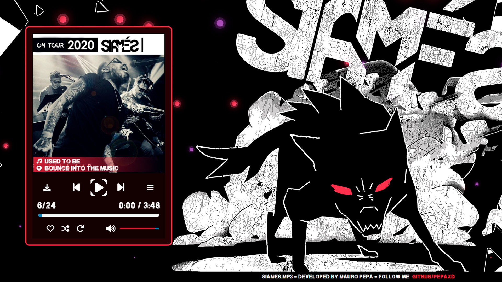

# SIAMES.mp3 Music Player Project

## Deploy GitHub-Page
https://pepaxd.github.io/SiamesMP3Player/

This is an interactive music player project that uses HTML, CSS, and JavaScript to allow users to play, pause, skip songs, adjust the volume, and more. 
The music player is part of a website called SIAMES.mp3.

## Features

- Music Playback: Play your favorite songs in MP3 format.
- Playback Control: Play, pause, skip to the next or previous song.
- Volume Control: Adjust the music volume.
- Playlist: View the list of available songs and select one to play.
- Shuffle Mode: Play songs in random order.
- Repeat Mode: Repeat the current song or the entire playlist.
- Favorites: Mark your favorite songs with a heart.
- Song Download: Download songs for offline listening.

## How to Use

1. Open the HTML file in your web browser to start using the music player.
2. Click on the playback buttons to control the music.
3. Use the progress bar to jump to a specific position in the song.
4. Adjust the volume with the volume slider.
5. Explore the available songs in the playlist.
6. Mark your favorite songs with the "Like" button.
7. Download songs by clicking the download button.

## Technologies Used

- HTML
- CSS
- JavaScript

## Website Structure
1. `index.html`: Homepage.
2. `/CSS` directoryStyle.
3. `/JS` directoryInteractive.
4. `/DiscArt` arrayImgSongs.
5. `/songs` arraySongs.
6. `/img` homeImg.

## Developed

Contact: [Mauro Pepa's GitHub](https://github.com/PEPAXD)

## License

This project is licensed under the MIT License. See the [LICENSE](LICENSE) file for more details.

---

Thank you for using SIAMES.mp3!
